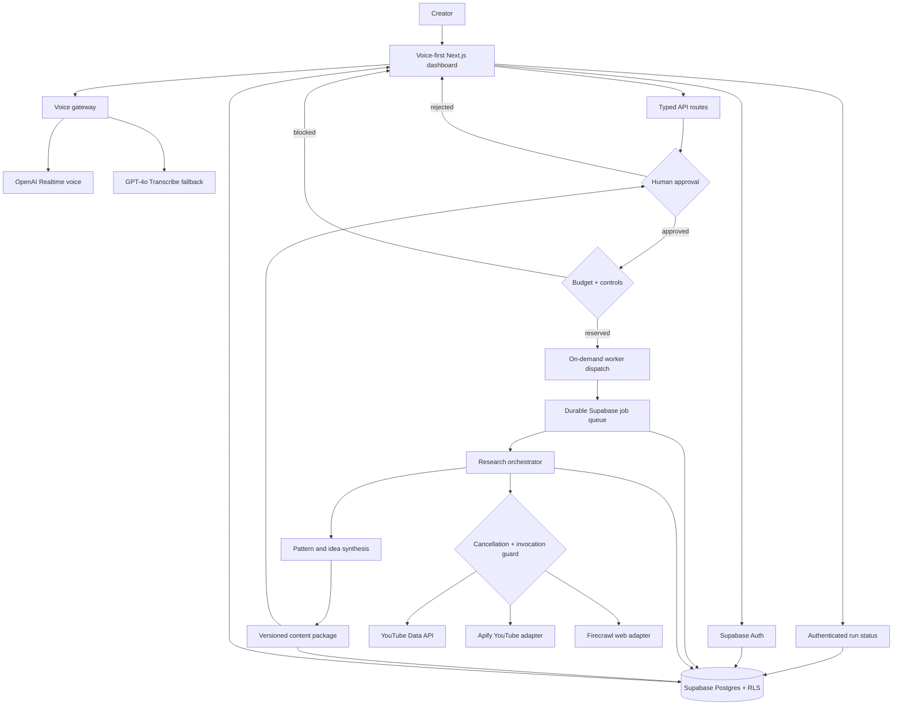
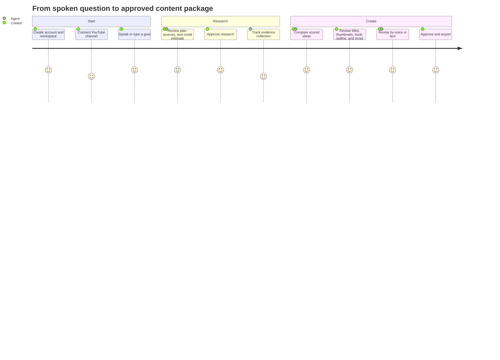
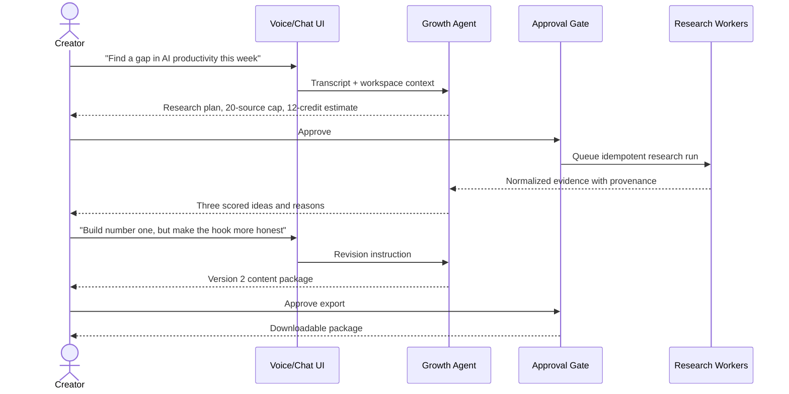
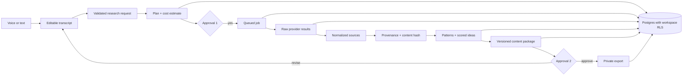
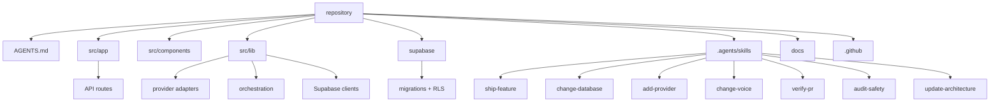
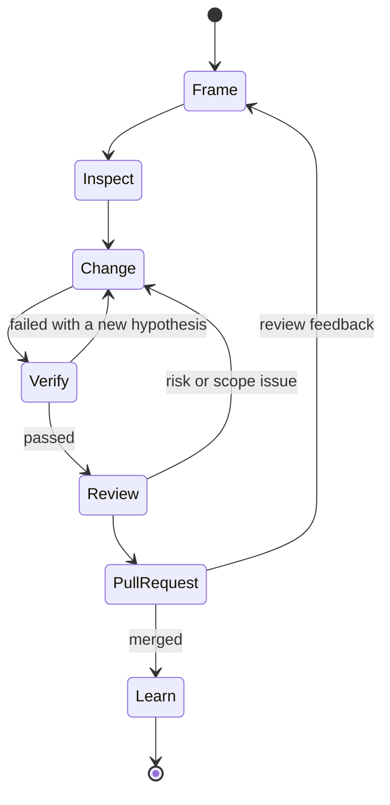

# YouTube Growth Stack

An open-source, voice-first research and content-planning SaaS for YouTube creators. Connect a channel, ask the growth agent a question, review its evidence, and approve a complete content package: ideas, titles, thumbnail concepts, hooks, an outline, and a script.

> **Current status:** controlled-beta foundation. Supabase identity, OpenAI voice, approval-gated jobs, bounded Apify/Firecrawl execution, research budgets, database controls, cancellation, live run status, and persisted evidence are implemented. Demo mode remains credential-free. Paid provider activation still requires hosted safety verification and separate approval; evidence-grounded idea synthesis and YouTube OAuth are later slices.


## Product architecture



## User experience

The dedicated `/onboarding` route guides a creator through profile and workspace setup, a demo-safe channel connection, an optional microphone check, and completion. The interface asks for explicit confirmation before it would open Google OAuth or request browser microphone access. Demo mode uses a typed channel adapter and does not request or store OAuth tokens; every voice action has a full keyboard and text alternative.

With Supabase configured, /onboarding keeps workspace creation on the authenticated server action and atomic create_workspace RPC. A successful immediate sign-up, email callback, or workspace creation continues at /onboarding?stage=channel, where the same flow starts at channel connection with the authenticated display and workspace names already supplied.



## Example conversation



## Data flow



## Repository structure



## Agent workflow

```mermaid
flowchart LR
  TASK[Issue or user request] --> READ[Read nearest AGENTS.md]
  READ --> SKILL[Load matching repository skill]
  SKILL --> CONTRACT[Inspect types, migrations, tests, ADRs]
  CONTRACT --> SLICE[Implement smallest vertical slice]
  SLICE --> CHECK[Focused checks]
  CHECK --> VERIFY[npm run verify]
  VERIFY --> DIFF[Security, UX, cost, docs diff review]
  DIFF --> PR[Focused pull request]
  PR --> FEEDBACK[CI + human feedback]
  FEEDBACK -->|changes| READ
  FEEDBACK -->|approved| MERGE[Squash merge]
```



## Implementation loop

Loop engineering is the development method, not a backend technology. Each pass turns a request into verified evidence and captures useful learning for the next contributor.



Read [Loop Engineering](docs/LOOP_ENGINEERING.md) for the plain-language repository mapping.

## Quick start

Requirements: Node.js 20.9+, npm, and optionally the Supabase CLI.

```bash
git clone https://github.com/satishgorantla1-sg7/youtube-growth-stack.git
cd youtube-growth-stack
cp .env.example .env.local
npm install
npm run dev
```

Open `http://localhost:3000`. Demo mode is on by default and does not spend provider credits.

To exercise real sign-up, sign-in, email callback, workspace onboarding, and sign-out, configure the two public Supabase variables and turn demo mode off. See [Supabase identity and workspace onboarding](docs/operations/auth-workspaces.md) for local setup, redirect configuration, policy tests, and migration/rollback notes.

To verify the same gates used by pull requests:

```bash
npm run verify
```

Durable research runs stop for approval before provider execution. Approval atomically reserves the bounded credit estimate and checks the database control plane before scheduling background dispatch. The worker checks cancellation, kill switches, and concurrency before each paid call, then reconciles safe invocation and usage metadata. Missing configuration leaves work safely stopped; connected mode never substitutes demo evidence.

`GET /api/health` reports liveness and non-sensitive configuration capability separately. Even with every credential present, paid research reports `hosted_verification_required` until the operator completes the [paid research safety runbook](docs/operations/research-safety-runbook.md). Health output never authorizes activation.

A continuously running worker is still available for local development or a future dedicated worker host:

```bash
npm run worker:research
```

See [Durable research jobs](docs/DURABLE_RESEARCH_JOBS.md) for dispatch recovery, lease/ack/fail contracts, deployment requirements, provider inputs, and rollback.

## Configure integrations

Copy `.env.example` to `.env.local` and add only the integrations you are testing. Never prefix a secret with `NEXT_PUBLIC_`.

| Capability | Environment variables | Safe fallback |
|---|---|---|
| Authentication and data | `NEXT_PUBLIC_SUPABASE_URL`, `NEXT_PUBLIC_SUPABASE_PUBLISHABLE_KEY` | UI demo only |
| Production worker | `SUPABASE_SERVICE_ROLE_KEY`, optional `RESEARCH_WORKER_ID` | Approved job remains queued |
| Voice | `OPENAI_API_KEY` and model overrides | Browser speech output + demo transcript |
| YouTube research | `APIFY_API_TOKEN` and actor ID | Deterministic source only in demo mode |
| Web research | `FIRECRAWL_API_KEY` | Deterministic source only in demo mode |
| Owned channel | Google OAuth variables | Example connected channel |

The default recorded-turn transcription model is `gpt-4o-transcribe`, which improves on original Whisper models. The realtime model is configurable because audio model availability evolves. Permanent OpenAI keys remain server-side; the Realtime route returns only short-lived client secrets. See the [OpenAI model catalog](https://developers.openai.com/api/docs/models) and [GPT-4o Transcribe](https://developers.openai.com/api/docs/models/gpt-4o-transcribe).

## Human approvals and safety

The application stops for explicit approval before paid deep research, channel actions, raw-audio retention, exports, and deletion. Provider results retain source URLs and capture timestamps. Raw audio is ephemeral by default. Workspace data is protected by Supabase row-level security.

Apify and Firecrawl availability does not grant permission to collect data. Deployers remain responsible for YouTube policies, provider terms, privacy notices, OAuth verification, deletion handling, and local law.

Before enabling production credentials, read the [public-launch safety and operations checklist](docs/SAFETY.md) and [paid research safety runbook](docs/operations/research-safety-runbook.md). They distinguish safeguards present in the repository from hosted verification, monitoring, provider-policy, privacy, and activation gates.

## Delivery roadmap

1. Repository foundation, demo experience, schemas, agent instructions, and CI.
2. Supabase authentication, onboarding, workspace creation, and tested RLS. (complete)
3. YouTube OAuth and channel snapshot ingestion.
4. Durable approval-gated worker, on-demand dispatch, status polling, and evidence display. (complete)
5. Production Firecrawl and Apify contracts with bounded requests. (complete; quota dashboards remain)
6. Evidence-grounded synthesis and versioned content packages.
7. Realtime WebRTC client, accessibility, voice consent, and retention jobs.
8. Billing, admin controls, observability, OAuth verification, and public beta.

## Contributing

Read [CONTRIBUTING.md](CONTRIBUTING.md), the closest `AGENTS.md`, and the matching workflow under `.agents/skills`. New work should begin with an issue and arrive as a focused pull request.

## License

MIT © 2026 Satish Gorantla. See [LICENSE](LICENSE).
