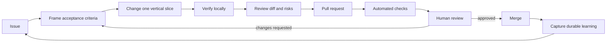

# Loop Engineering, in plain language

Loop engineering means building the repository so each change produces evidence, feedback, and reusable learning. The “loop” is not a server framework and it does not replace the backend. It is the way humans and coding agents safely improve the product.

## Where it lives

| Repository surface | What it contributes to the loop |
|---|---|
| `AGENTS.md` | Durable rules and verification commands |
| `.agents/skills/*` | Repeatable procedures for common changes |
| `.github/workflows/ci.yml` | Independent, reproducible evidence |
| `.github/pull_request_template.md` | Human review checklist |
| `docs/decisions/*` | Why consequential choices were made |
| Tests and migrations | Executable product and data contracts |

The loop is successful when a future contributor can understand a decision, reproduce the checks, and make the next change without guessing.
