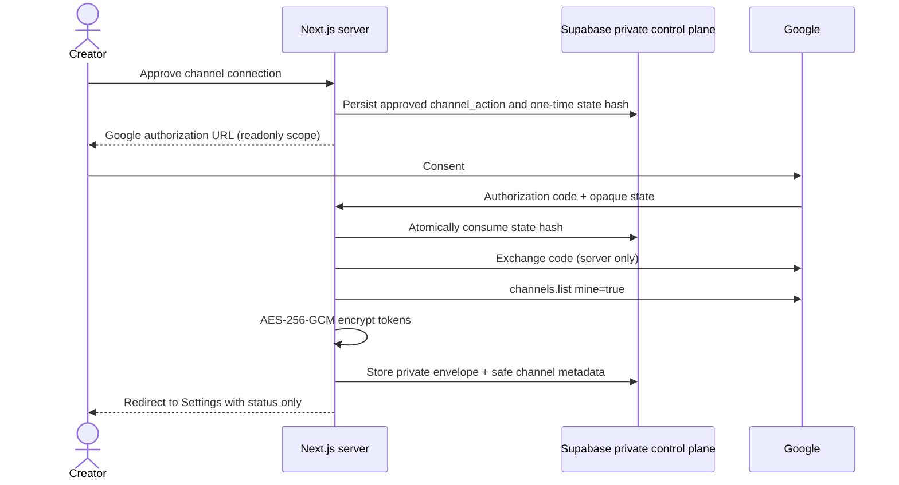

# YouTube OAuth security and lifecycle

## Flow

## Operational behavior

- The state lifetime is ten minutes. Consumption happens before token exchange so callbacks cannot be replayed.
- Only `youtube.readonly` is accepted. A broader or missing returned scope fails closed.
- Provider requests time out after ten seconds. `429` and `5xx` map to a retryable safe error; provider bodies are not logged or returned.
- Token refresh and revocation require a database lease. Concurrent callers receive `locked` and make no Google call.
- `invalid_grant` marks the connection `reconnect_required`. Users must approve and start a new OAuth flow.
- Revocation requires a separate approved `channel_action`, contacts Google first, then erases the local credential envelope. A failed Google revocation does not falsely report local completion.
- Access and refresh tokens never appear in browser responses, URL query strings, application logs, tests snapshots, or public/RLS-readable rows.

## Verification checklist

1. Configure the exact production redirect URI in Google Cloud and in `YOUTUBE_REDIRECT_URI`.
2. Confirm the consent screen shows read-only YouTube access and no broader scope.
3. Run database tests for one-time consume, expiry, replay, cross-user, cross-workspace, and lease races.
4. Connect a dedicated test channel, refresh after access expiry, revoke, and verify reconnect status.
5. Search server logs and browser network payloads for token-shaped values before enabling production.

This code deliberately does not make live credential calls in CI. The database migration and generated Supabase types are owned by the database delivery slice.
