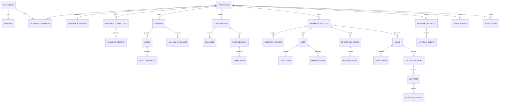
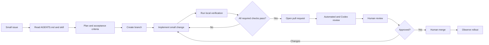

# YT Growth Stack - Data and Repository Blueprint

This document converts the approved logical architecture into a concrete Supabase data model, storage policy, repository layout, agent instruction hierarchy, reusable repository skills, pull-request loop, and phased delivery sequence.

## 1. Plain-language summary

The database is organized around a workspace. A workspace is the secure container for one customer or team. Channels, conversations, research, ideas, content packages, approvals, jobs, and usage all belong to exactly one workspace.

The repository is organized around product capabilities rather than technical file types. A coding agent working on research should find research UI, server logic, tests, contracts, and relevant guidance close together. Shared provider clients and database code remain behind explicit server-only interfaces.

## 2. Supabase schema map

### Identity and tenancy

| Table | Purpose | Key relationships |
|---|---|---|
| `profiles` | Product-facing user record linked to `auth.users` | `profiles.id = auth.users.id` |
| `workspaces` | Tenant, plan owner, and security boundary | Parent of all customer-owned records |
| `workspace_members` | Membership and role assignment | Joins users to workspaces |
| `workspace_settings` | Retention, language, voice, research, and brand preferences | One-to-one with workspace |

Roles for the first version: `owner`, `admin`, `editor`, and `viewer`. Authorization comes from `workspace_members`, not user-editable authentication metadata.

### Connections and channels

| Table | Purpose | Key relationships |
|---|---|---|
| `provider_connections` | Safe metadata about a connected provider | Belongs to workspace and connecting user |
| `provider_secrets` | Reference to encrypted OAuth/API credentials | Private schema; never available to browser clients |
| `channels` | Normalized owned or competitor YouTube channel | Belongs to workspace |
| `channel_snapshots` | Time-series channel metrics | Belongs to channel |
| `videos` | Normalized YouTube video metadata | Belongs to channel |
| `video_snapshots` | Time-series video metrics | Belongs to video |

`provider_connections` stores status, provider, scopes, expiry metadata, and the last successful sync. The actual YouTube refresh token is stored as an encrypted secret and is usable only by trusted server code. Supabase Auth does not automatically refresh or persist third-party provider tokens for this use case.

### Conversations and voice

| Table | Purpose | Key relationships |
|---|---|---|
| `conversations` | One customer-agent work thread | Belongs to workspace and optionally a research project |
| `messages` | User, agent, tool, and system messages | Belongs to conversation |
| `voice_sessions` | Realtime session metadata and usage | Belongs to conversation |
| `transcripts` | Reviewable transcript versions | Belongs to message or voice session |

Raw microphone audio is not stored by default. `voice_sessions` records provider, configured model, duration, latency, status, and cost metadata. A transcript is versioned so approval applies to a specific text version.

### Research and evidence

| Table | Purpose | Key relationships |
|---|---|---|
| `research_projects` | Customer research request and scope | Belongs to workspace and conversation |
| `research_targets` | Owned channel, competitor, keyword, URL, or niche | Belongs to research project |
| `jobs` | Durable asynchronous workflow instance | Belongs to workspace; may belong to a research project or package |
| `job_events` | Append-only state and progress history | Belongs to job |
| `provider_runs` | One YouTube, Apify, Firecrawl, or model invocation | Belongs to job |
| `source_documents` | Normalized video, transcript, comment set, or web page | Belongs to workspace and research project |
| `evidence_items` | Small claim-bearing evidence unit with provenance | Belongs to source document |

`source_documents` retains the canonical URL, provider, source type, external ID, collected time, content hash, structured metadata, confidence, and an optional private Storage object path for raw payloads. Duplicate detection uses external IDs and content hashes.

### Ideas, packages, and approvals

| Table | Purpose | Key relationships |
|---|---|---|
| `ideas` | Candidate video concept | Belongs to research project |
| `idea_scores` | Versioned scoring breakdown | Belongs to idea |
| `content_packages` | Approved idea being developed | Belongs to workspace, research project, and selected idea |
| `artifacts` | Title set, thumbnail concept, hook, outline, or script | Belongs to content package |
| `artifact_versions` | Immutable generated or edited version | Belongs to artifact |
| `approval_requests` | Human decision request for a versioned subject | Belongs to workspace; references transcript, research, idea, or artifact version |
| `approval_events` | Append-only approval decision history | Belongs to approval request |

An approved artifact version never changes. An edit creates a new `artifact_version` and returns the item to review.

### AI, billing, and audit

| Table | Purpose | Key relationships |
|---|---|---|
| `prompt_versions` | Versioned prompts, schemas, and evaluation status | Referenced by model runs |
| `model_runs` | Model, prompt, token, latency, cost, and output metadata | Belongs to workspace and optionally a job |
| `usage_events` | Append-only metering ledger | Belongs to workspace and source operation |
| `subscriptions` | Billing provider customer/subscription mirror | Belongs to workspace |
| `webhook_receipts` | Deduplicated inbound provider events | Private schema; service-only |
| `audit_events` | Security and product mutation trail | Belongs to workspace where applicable |

Usage is recorded as an append-only ledger rather than overwriting a total. Summaries are computed from the ledger and can be reconciled against provider invoices.

## 3. Relationship summary



## 4. Security boundaries

### Public application schema

Tables intentionally queried through the Supabase client live in `public`, have RLS enabled, and carry a non-null `workspace_id` when tenant-owned.

Baseline access rules:

- A workspace member can select records in that workspace.
- Owners and admins manage membership, connections, billing-facing settings, and destructive actions.
- Editors create and update research and content.
- Viewers have read-only access.
- Inserts must set a workspace the authenticated user already belongs to.
- Updates cannot move records between workspaces.
- Cross-workspace access is denied even when a caller guesses a UUID.

### Private server schema

The browser receives no privileges on:

- `private.provider_secrets`
- `private.webhook_receipts`
- raw provider payload metadata that exposes credentials or internal request details
- administrative cost reconciliation

Background jobs use a server-only credential. Service-role use stays inside narrow repository adapters and is never imported by client components.

### RLS implementation pattern

Create small, reviewed SQL helper functions such as `is_workspace_member(workspace_id)` and `has_workspace_role(workspace_id, allowed_roles)`. Index `workspace_members(user_id, workspace_id)` and every tenant table's `workspace_id`.

Do not store authorization roles in `raw_user_meta_data`, because authenticated users can modify that field. Test policies using pgTAP with owner, editor, viewer, outsider, anonymous, and service contexts. Every tenant table receives both positive and negative cross-tenant tests.

## 5. Storage design

All product buckets are private.

| Bucket | Contents | Writer | Reader |
|---|---|---|---|
| `raw-research` | Raw Apify, Firecrawl, YouTube, and model payload exports | Service jobs | Admin/support service only |
| `workspace-assets` | Approved thumbnails, images, reference files, and uploads | Workspace editors | Workspace members |
| `exports` | Generated briefs, scripts, and package exports | Service jobs or editors | Workspace members through signed URLs |

Paths begin with the workspace ID: `<workspace_id>/<project_id>/<object>`. Storage RLS checks the first path segment against membership. Upload size and MIME restrictions are configured per bucket.

Database backups do not include Storage objects, so production recovery must cover both Postgres and object storage.

## 6. Realtime and job updates

Use Supabase Realtime Broadcast with private channels for scalable job progress. Topic format: `workspace:<workspace_id>:job:<job_id>`. Authorization checks workspace membership before joining.

The durable truth remains `jobs` and `job_events`; Realtime only improves the interface. If an event is missed, the browser reloads current job state from Postgres.

Job state sequence:

`queued -> collecting -> normalizing -> analysing -> awaiting_approval -> generating -> validating -> completed`

Terminal or exceptional states:

`failed`, `cancelled`, `expired`, and `blocked`.

Every external callback is authenticated, recorded in `webhook_receipts`, deduplicated by provider event ID, and processed idempotently.

## 7. Repository structure

```text
YT Growth Stack/
|-- AGENTS.md
|-- README.md
|-- package.json
|-- pnpm-workspace.yaml
|-- turbo.json
|-- .env.example
|-- .agents/
|   `-- skills/
|       |-- add-feature-slice/SKILL.md
|       |-- add-supabase-migration/SKILL.md
|       |-- add-provider-adapter/SKILL.md
|       |-- change-ai-prompt/SKILL.md
|       |-- diagnose-job-failure/SKILL.md
|       |-- prepare-pull-request/SKILL.md
|       `-- update-architecture/SKILL.md
|-- .github/
|   |-- ISSUE_TEMPLATE/
|   |-- pull_request_template.md
|   |-- CODEOWNERS
|   `-- workflows/
|       |-- quality.yml
|       |-- database.yml
|       |-- e2e.yml
|       `-- security.yml
|-- apps/
|   `-- web/
|       |-- AGENTS.md
|       |-- src/app/
|       |-- src/components/
|       |-- src/features/
|       |   |-- auth/
|       |   |-- conversation/
|       |   |-- research/
|       |   |-- ideas/
|       |   |-- content-packages/
|       |   |-- approvals/
|       |   `-- billing/
|       `-- src/server/
|           |-- workflows/
|           |-- integrations/
|           |   |-- AGENTS.md
|           |   |-- openai/
|           |   |-- youtube/
|           |   |-- apify/
|           |   `-- firecrawl/
|           |-- security/
|           `-- observability/
|-- packages/
|   |-- contracts/
|   |-- database/
|   |-- design-system/
|   |-- test-utils/
|   `-- typescript-config/
|-- supabase/
|   |-- AGENTS.md
|   |-- config.toml
|   |-- migrations/
|   |-- seed.sql
|   `-- tests/database/
|-- tests/
|   |-- contract/
|   |-- integration/
|   `-- e2e/
|-- docs/
|   |-- architecture/
|   |-- decisions/
|   |-- runbooks/
|   `-- product/
`-- scripts/
    |-- verify.mjs
    |-- check-migrations.mjs
    `-- check-env.mjs
```

This is a modular monorepo with one application. It creates a stable location for shared contracts and a future worker without forcing a separate worker deployment in the MVP.

## 8. AGENTS.md hierarchy

Codex reads instructions from the repository root down to the current directory, with the closest applicable file taking precedence. Keep the combined guidance below the default 32 KiB instruction budget.

### Root `AGENTS.md`

Contains durable repository-wide guidance only:

- Product definition and architectural boundaries.
- Required commands and package manager.
- No browser exposure of provider or service-role secrets.
- Every tenant-owned table requires `workspace_id`, RLS, indexes, and negative tests.
- Long operations use durable jobs, never open page requests.
- Human approval requirements.
- Definition of done and PR expectations.
- Repository-wide code review rules for tenant isolation, credential leakage, idempotency, and approval bypasses.

### `apps/web/AGENTS.md`

- Server and client component boundaries.
- Voice and text accessibility parity.
- Feature-slice organization.
- UI error, loading, retry, and approval-state requirements.
- TweakCN/shadcn design-token rules.

### `apps/web/src/server/integrations/AGENTS.md`

- Provider adapter contract.
- Timeout, retry, webhook authentication, idempotency, and redaction rules.
- No provider-specific objects past the normalization boundary.
- Contract fixtures for every adapter.

### `supabase/AGENTS.md`

- Forward-only migrations.
- RLS enabled in the same migration as a tenant table.
- Index every RLS predicate and foreign key used by the application.
- pgTAP policy tests and cross-tenant negative cases.
- No destructive production migration without an explicit rollout and rollback plan.

Nested instructions should be added only when a directory has genuinely different rules. Mechanical formatting belongs in CI rather than AGENTS.md review guidance.

## 9. Repository skills

Codex discovers repository skills under `.agents/skills`. Each skill is one directory with a `SKILL.md`; supporting schemas, examples, assets, or deterministic scripts live beside it.

| Skill | Trigger | Required output |
|---|---|---|
| `add-feature-slice` | Add or change a product capability | UI, server logic, contracts, tests, states, and documentation |
| `add-supabase-migration` | Change schema, policies, functions, or buckets | Forward migration, indexes, generated types, pgTAP tests, rollback note |
| `add-provider-adapter` | Integrate or modify YouTube, OpenAI, Apify, or Firecrawl | Adapter, normalized contract, fixtures, timeouts, retries, redaction, contract tests |
| `change-ai-prompt` | Modify a prompt, output schema, model route, or scoring rubric | New prompt version, fixtures, eval cases, migration impact, cost note |
| `diagnose-job-failure` | Investigate a failed or stuck workflow | Timeline, root cause, affected jobs, safe retry path, prevention test |
| `prepare-pull-request` | Finish a branch for review | Verification results, migration notes, screenshots, risks, rollout, rollback |
| `update-architecture` | Change a durable architecture decision | Updated diagram, decision record, affected AGENTS.md and skills, source refresh |

Descriptions must clearly state when the skill should and should not trigger. Prefer instructions; add scripts only for deterministic validation or transformation.

## 10. Pull-request loop



Required CI checks:

1. Formatting, lint, TypeScript, and production build.
2. Unit tests and feature contract tests.
3. Supabase migration validation and pgTAP RLS tests.
4. Provider adapter contract tests using fixtures, not live credentials.
5. Playwright tests for authentication, voice-text fallback, research approval, idea approval, and package review.
6. Secret scanning and dependency/security checks.
7. Preview deployment and visual evidence for interface changes.

Codex review rules focus on consequential product-specific behavior. Deterministic formatting stays in CI. Branch protection requires passing checks and at least one human approval; the agent does not merge its own pull request.

## 11. Delivery phases

### Phase 0 - Repository foundation

- Git repository, package workspace, Next.js shell, Supabase local development, CI, root AGENTS.md, first repository skills, and architecture decision records.

### Phase 1 - Secure SaaS shell

- Supabase Auth, workspaces, membership, roles, RLS helpers/tests, private Storage buckets, base dashboard, and usage ledger.

### Phase 2 - Voice conversation cockpit

- Realtime voice session, live transcript, text fallback, conversations/messages, transcript review, session metering, and voice privacy settings.

### Phase 3 - Owned-channel connection

- Google OAuth, encrypted refresh-token handling, channel sync, snapshots, quota telemetry, reconnection, and deletion flow.

### Phase 4 - Competitor research

- Research projects and targets, durable jobs, Apify and Firecrawl adapters, webhook receipts, normalization, provenance, evidence viewer, retries, and cancellation.

### Phase 5 - Ideas and approval

- Pattern extraction, candidate ideas, versioned scores, evidence explanations, shortlist interface, and idea approval.

### Phase 6 - Complete content packages

- Titles, thumbnail concepts, hooks, outlines, scripts, artifact versions, validation, approval history, editor, and exports.

### Phase 7 - Commercial hardening

- Billing, plan limits, admin/support tools, cost reconciliation, rate limiting, retention/deletion, monitoring, incident runbooks, and quota audit preparation.

Each phase should be split into pull requests that leave the main branch deployable.

## 12. Highest-risk boundaries

| Risk | Architectural control | Verification |
|---|---|---|
| Cross-tenant data leak | `workspace_id`, RLS, membership helpers, private schemas | pgTAP positive and negative tests |
| OAuth/API credential leak | Vault/encrypted secret storage, server-only adapters, redacted logs | Secret scan and integration tests |
| Duplicate provider callbacks | `webhook_receipts` unique provider event ID, idempotent handlers | Replay the same fixture twice |
| Runaway voice or model spend | Workspace budgets, usage ledger, server-side session issuance | Limit tests and cost dashboards |
| Lost job progress | Durable jobs/events; Realtime is not source of truth | Disconnect/reconnect tests |
| Unsupported AI claims | Evidence items and source references | Output schema and evidence evals |
| Approval bypass | Immutable versions and approval state machine | End-to-end permission tests |
| YouTube quota exhaustion | Request accounting, caching, backoff, quota telemetry | Quota simulations and alerts |
| Scraper instability or policy change | Provider adapters, source labels, graceful partial results | Contract fixtures and fallback tests |
| Storage recovery gap | Separate object backup/retention plan | Recovery exercise covering DB and objects |

## 13. Sources

- [Codex custom instructions with AGENTS.md](https://learn.chatgpt.com/docs/agent-configuration/agents-md)
- [Codex build skills](https://learn.chatgpt.com/docs/build-skills)
- [Codex code review in GitHub](https://learn.chatgpt.com/docs/third-party/github)
- [Supabase row-level security](https://supabase.com/docs/guides/database/postgres/row-level-security)
- [Supabase database testing](https://supabase.com/docs/guides/local-development/testing/overview)
- [Supabase Realtime subscriptions](https://supabase.com/docs/guides/realtime/subscribing-to-database-changes)
- [Supabase Vault](https://supabase.com/docs/guides/database/vault)
- [Supabase Storage buckets](https://supabase.com/docs/guides/storage/buckets/fundamentals)
- [Supabase Database Webhooks](https://supabase.com/docs/guides/database/webhooks)
- [Supabase social-login provider tokens](https://supabase.com/docs/guides/auth/social-login)

