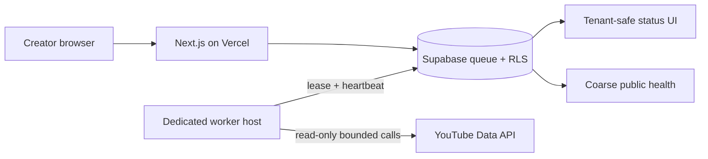

# YouTube sync worker operations

The YouTube synchronization worker is a separate, long-running Node.js process. The Next.js/Vercel web deployment validates and queues bounded requests; it does **not** execute the queue continuously.

## Deployment topology



Run exactly one web deployment and one or more dedicated worker processes against the same Supabase project. A container worker, managed background service, or VM process manager is suitable. A Vercel request/function is not a substitute for this continuously polling process.

## Start command

The worker needs the server-only Supabase service-role key, Google OAuth configuration, and token-encryption keys documented in `.env.example`. Do not expose them as `NEXT_PUBLIC_*` values.

```bash
npm ci
npm run worker:youtube
```

Each process generates an ephemeral UUID used for private leases, heartbeats, and allowlisted operational log correlation. Hostnames, usernames, tokens, channel identifiers, and queue payloads are not stored in the heartbeat ledger or returned by its status contract.

## Heartbeat and alerts

The worker writes an allowlisted status at startup/poll time, every ten seconds during a sync, and after the attempt. The customer-facing contract exposes only:

- `healthy`: a heartbeat arrived within 30 seconds;
- `stale`: a worker has been seen, but not within 30 seconds;
- `not_seen`: this database has never observed the worker;
- `unavailable` or `configuration_required`: the web service cannot verify the heartbeat.

Alert an operator when any of these holds:

1. `/api/health` reports `workers.youtubeSync.status` as `stale`, `not_seen`, or `unavailable` for two consecutive checks.
2. A workspace sync is `stalled` (an expired running lease, or a queue older than two minutes without a healthy heartbeat).
3. The worker process restarts repeatedly or emits an allowlisted `youtube_worker_error` code.

Never attach raw provider responses, credentials, channel metadata, or transcript data to heartbeat alerts.

## Kill switch and incident response

1. Disable `youtube_api` in the existing provider control plane. This stops authorization, sync leasing, and token refresh fail-closed.
2. Stop the dedicated worker process gracefully and wait at least the 180-second lease window before maintenance.
3. Leave queued rows durable. Do not mark them completed or delete them to make the UI green.
4. Investigate using correlation IDs and allowlisted error codes, not token or response payloads.
5. Re-enable only after hosted checks and separate operator approval. A healthy heartbeat is operational evidence, not provider-activation approval.

## Rollback

Keep the provider disabled, stop workers, allow leases to expire, and ship a forward-only corrective migration. Do not rewrite migration `202608030014` after it has been applied. If the application is rolled back before the migration, the private heartbeat table is harmless and inaccessible to browser roles; the older UI will continue reading tenant-scoped sync rows.
