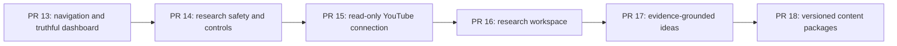

# PR 13-18 delivery design

**Status:** Proposed for user review

**Base:** `origin/main` at `25289f2`

**Product:** YouTube Growth Stack

**Owner:** Root orchestration agent

## 1. Outcome

Deliver six reviewable vertical slices that turn the current voice-first MVP into a truthful, navigable product with bounded research, a real read-only YouTube connection, an evidence-grounded idea library, and versioned content packages.

The merge order is fixed because each later slice depends on contracts established by the previous slice:

Agents may design and implement non-overlapping internals in parallel, but PRs merge sequentially. No agent may merge a PR, deploy production, enable paid credentials, or bypass branch protection without explicit user authorization.

## 2. Current foundation

Already implemented:

- Supabase authentication, password recovery, workspace membership, roles, and RLS.
- Voice recording, explicit upload consent, OpenAI transcription, transcript review, and spoken replies.
- Approval-gated research plans with idempotent database transitions.
- Durable research jobs, leases, retries, dead letters, correlation IDs, Apify, Firecrawl, and persisted evidence.
- Foundational tables for channels, projects, research, sources, ideas, packages, approvals, usage, jobs, and audit events.

Known gaps:

- More than fifteen visible dashboard controls do nothing or display hard-coded information.
- The channel connection is session-only demo behavior.
- Paid research lacks atomic budgets, distributed limits, kill switches, reconciliation, and full cancellation.
- Research history has no dedicated workspace UI.
- Ideas and packages have schema shapes but no safe generation or state-transition contracts.
- Cross-workspace relational references need stronger enforcement before generated ideas and packages are enabled.

## 3. Delivery model and agent harness

The root agent is the only integrator. Sub-agents receive bounded tasks, isolated worktrees, explicit file ownership, acceptance criteria, and a required verification report.

Each slice follows the repository loop:

1. **Frame:** record measurable acceptance criteria and non-goals.
2. **Inspect:** read `AGENTS.md`, nested instructions, migrations, contracts, tests, and ADRs.
3. **Change:** implement the smallest coherent vertical slice in an isolated branch.
4. **Verify:** run focused tests, database tests where relevant, `npm run verify`, and desktop/mobile browser acceptance.
5. **Review:** root agent audits diff scope, tenant isolation, authorization, cost, accessibility, secrets, migrations, and rollback.
6. **Learn:** update tests, documentation, ADRs, skills, or agent instructions when a durable rule was discovered.
7. **PR:** root agent opens a focused PR with risks, screenshots, verification, migration notes, and rollback.

### Parallelism rules

- Maximum three sub-agents plus the root orchestrator.
- Shared files have one owner per slice.
- Only the root agent allocates migration numbers, regenerates database types, changes shared environment contracts, and resolves integration conflicts.
- Later branches start from the accepted predecessor, not from stale local `main`.
- Agents may not silently widen OAuth scopes, source limits, model spend, approval permissions, or retention.
- A failing gate stops that slice; downstream integration does not hide or waive the failure.

## 4. PR 13 - Real navigation and truthful dashboard

### Purpose

Remove misleading prototype behavior and establish stable route and shell boundaries for every later product screen.

### Scope

- Extract a reusable authenticated workspace shell and Link-based navigation.
- Add routes for `/research`, `/ideas`, `/packages`, `/approvals`, `/performance`, `/projects/new`, `/usage`, and `/settings`.
- Preserve the command centre's working voice, text, research-plan, approval, and evidence behavior.
- Replace hard-coded channel, credit, idea, approval, activity, and readiness claims with tenant-scoped Supabase queries.
- Show explicit empty, unavailable, loading, and error states.
- Make every visible control functional or visibly disabled with an explanation.
- Keep demo mode deterministic and clearly labelled.

### Data

Use existing `workspaces`, `channels`, `projects`, `research_runs`, `research_sources`, `ideas`, `content_packages`, `approvals`, and `usage_ledger`. Performance remains an honest empty state until YouTube ingestion exists.

### Acceptance gates

- No unexplained dead controls.
- Active navigation and breadcrumbs are correct and accessible on desktop and mobile.
- Connected mode shows only RLS-backed data; zero records produce honest empty states.
- Provider readiness never claims "all ready" when configuration is missing.
- Existing authentication, voice, text, approval, and onboarding tests remain green.
- `npm run verify` and browser acceptance pass.

### Ownership

- UI owner: workspace shell, navigation, command-centre extraction, and route presentation.
- Data owner: dashboard view models, tenant-scoped server queries, and page wiring.
- Verification owner: component tests and desktop/mobile acceptance.
- Root only: `src/app/page.tsx`, shared global CSS integration, and conflict resolution.

## 5. PR 14 - Research safety, budgets, and operational controls

### Purpose

Make paid research enforceably bounded before production Apify and Firecrawl credentials are enabled.

### Scope

- Reserve estimated credits atomically during approval-to-queue.
- Reject jobs over workspace daily limits and settle actual usage on completion, failure, or cancellation.
- Add database-backed user/workspace request limits and workspace/provider/global concurrency caps.
- Add database-backed global, provider, and workspace kill switches checked before queueing and before every paid call.
- Add owner/admin cancellation, worker cancellation checks, and safe provider abort plumbing.
- Record safe provider invocation metadata, duration, bounded units, error codes, and correlation IDs.
- Add queue-age, retry, dead-letter, quota, rate-limit, budget-drift, and lease-expiry observability contracts.
- Keep prompts, source content, tokens, and unnecessary personal data out of logs.

### Data and state

Append a forward-only safety migration for credit reservations, provider invocations, operational controls, cancellation states, indexes, RLS, grants, and security-definer RPCs. Strengthen same-workspace relational integrity where required.

### Acceptance gates

- Concurrent approvals cannot over-reserve a workspace budget.
- Duplicate approval or callback attempts do not double-spend.
- Kill switches stop new paid calls without deployment.
- Cancellation releases unused reservations and preserves already incurred usage.
- Hosted two-user RLS and cross-workspace injection tests pass.
- Migration reset, generated types, focused race tests, `npm run verify`, and audit-safety pass.
- Paid credentials remain disabled until controls and alerts pass hosted verification.

### Ownership

- Database owner: migrations, RPCs, pgTAP, and generated types.
- Worker owner: budgets, controls, cancellation, invocation ledger, and focused tests.
- Operations owner: health/readiness, safe observability, runbook, and hosted test checklist.
- Root only: shared environment schema and final integration.

## 6. PR 15 - Real read-only YouTube connection

### Purpose

Replace the demo channel with a secure, quota-aware owned-channel connection and snapshot pipeline.

### Scope

- Server-side Google OAuth authorization-code flow with one-time, short-lived state bound to user and workspace.
- Request only `youtube.readonly`; no upload, edit, delete, or publishing scopes.
- Encrypt refresh tokens at rest with key versioning; credentials remain private and server-only.
- Support Brand Account or multiple-channel selection explicitly.
- Ingest channel metadata, uploads playlist, bounded video metadata, and snapshots using quota-efficient endpoints.
- Add idempotent sync, pagination bounds, timeouts, backoff, quota accounting, reconnect, expired/revoked states, and refresh locking.
- Disconnect revokes the token and deletes credentials; imported-data deletion remains a separate approved action.

### Acceptance gates

- OAuth state resists CSRF, replay, expiry, and cross-workspace swaps.
- Only the read-only YouTube scope is requested.
- Tokens never reach browser code, RLS-visible rows, logs, or test snapshots.
- Refresh-token omission, `invalid_grant`, quota exhaustion, timeout, reconnect, and revoke failures have safe behavior.
- Sync is bounded and idempotent.
- Dedicated test-channel smoke, RLS tests, `npm run verify`, and browser acceptance pass.

### Ownership

- Integration owner: OAuth routes, encryption adapter, token lifecycle, and provider tests.
- Data owner: connection/snapshot migration, RLS, quota ledger, and ingestion repository.
- UI owner: connect, select, sync, reconnect, disconnect, and honest status screens.
- Root only: environment contract, redirect checklist, migration numbering, and integration.

## 7. PR 16 - Research workspace and evidence explorer

### Purpose

Turn the existing research engine into a usable history and evidence product.

### Scope

- Paginated `/research` history and `/research/[runId]` detail screens.
- Filters for state, project, and date.
- Evidence viewer with provider, URL, capture time, provenance, and safe content preview.
- Configuration-required, queued, running, completed, failed, cancelled, and dead-letter states.
- Audited cancellation and safe retry as a new approved run rather than silent re-spend.
- Required indexes and same-workspace project/run/source integrity.

### Acceptance gates

- Members see only their workspace's runs and sources.
- Editors may request research; only owner/admin may approve paid execution.
- Cancellation stops future calls where technically possible and never claims to undo an in-flight vendor charge.
- Lists do not leak full scraped content.
- Pagination, filters, loading, empty, failure, mobile, and keyboard flows pass.
- `npm run verify`, database tests, and browser acceptance pass.

## 8. PR 17 - Evidence-grounded Idea Library

### Purpose

Generate explainable ideas from completed research without allowing invented citations or client-authored scores.

### Scope

- Durable, idempotent idea generation from a completed research run.
- Strict Zod AI output contract with bounded counts, timeouts, model version, and prompt version.
- Store generation runs and an `idea_evidence` relationship to validated research-source IDs.
- Verify every cited source belongs to the same workspace and research run.
- Store explainable demand, relevance, competition, and confidence dimensions.
- Add `/ideas`, `/ideas/[ideaId]`, shortlist, approve, reject, archive, and filters.
- Keep generated scores and provenance server-owned; clients use authorized state-transition RPCs only.
- Provide deterministic demo generation with no OpenAI spend.

### Acceptance gates

- Every generated idea cites at least one valid source.
- Unknown, invented, or cross-workspace source IDs fail closed.
- Malformed model output does not persist partial ideas.
- Users can understand the score dimensions and evidence.
- Viewer/editor/owner/admin permissions and cross-tenant injection tests pass.
- AI contract tests, no-spend demo tests, `npm run verify`, and browser acceptance pass.

## 9. PR 18 - Versioned Content Packages

### Purpose

Turn an approved idea into an auditable, editable, evidence-linked video package.

### Scope

- Generate only from an approved idea.
- Strict typed contracts for titles, thumbnail concepts, hooks, outline, script, and citations.
- Atomic version creation using a database lock; no duplicate version numbers.
- Draft editing and autosave with immutable non-draft versions.
- Request approval, approve, reject, and create-next-version RPCs.
- Add `/packages`, `/packages/[packageId]`, version comparison, citation viewer, and approval history.
- Persist citations as same-workspace references to research sources.
- Treat export as a separately approved and audited action.
- Provide deterministic demo packages with no OpenAI spend.

### Acceptance gates

- Concurrent version requests cannot create duplicates.
- Approved or rejected versions cannot be silently edited.
- Every citation resolves to evidence in the same workspace.
- Approval history remains append-only.
- A rejected package creates a new draft without rewriting history.
- End-to-end research to evidence to idea to package to approval passes.
- Database, AI contract, authorization, accessibility, `npm run verify`, and browser tests pass.

## 10. Pull-request and review policy

Each PR must include:

- Measurable acceptance criteria and explicit non-goals.
- Risk, authorization, cost, migration, deployment, and rollback notes.
- Focused tests plus full verification output.
- Desktop and mobile screenshots for user-visible changes.
- Secret scan and generated-artifact check.
- Migration reset and RLS evidence where data contracts change.
- An ADR or documentation update for consequential decisions.

The root agent opens PRs but does not merge them. The user reviews and explicitly approves each merge. Administrator bypass and production deployment always require separate explicit authorization.

## 11. Stopping conditions

Stop downstream delivery and ask for direction when:

- A migration or public contract must be destructively rewritten.
- OAuth requires broader scopes than `youtube.readonly`.
- A paid provider cannot be bounded, reconciled, or disabled without deploy.
- Cross-tenant isolation or role authorization fails.
- Model output cannot be tied to validated evidence.
- A later slice would require merging an unapproved predecessor.
- Production credentials, legal/provider-policy approval, or external console configuration is required.

## 12. Explicit non-goals through PR 18

- Publishing, editing, or deleting YouTube videos.
- Autonomous approval through voice or chat.
- Billing collection and subscription enforcement.
- Full YouTube Analytics performance dashboards.
- Team invitation administration.
- Raw-audio retention.
- Automatic public deployment or paid credential activation.

These remain later, separately approved slices.
